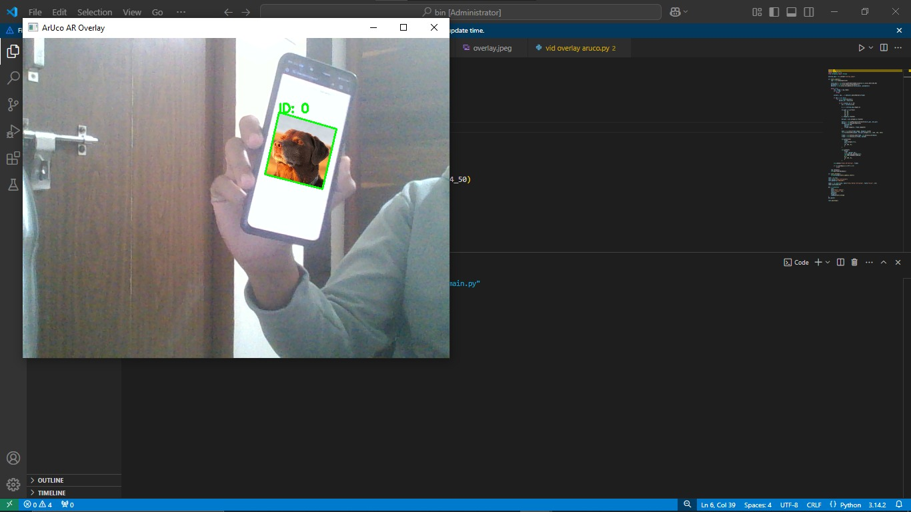

# ArUco Marker Overlay Projects (Webcam & Video)

## Description
This repository contains ArUco marker–based augmented reality projects developed using OpenCV. The projects detect ArUco markers (IDs 0–50) and overlay an image on the detected marker in both live webcam feed and pre-recorded video.

## Projects Included
- ArUco Image Overlay on Webcam
- ArUco Image Overlay on Video

## Folder Structure
```

Aruco-overlay/
├── aruco-image-overlay-webcam/
│   └── aruco-image-overlay-webcam.py
├── aruco-video-overlay-webcam/
│   └── aruco-video-overlay-webcam.py
├── images/
│   └── Aruco-overlay.jpeg
└── README.md

```

## Technologies Used
- Python
- OpenCV
- ArUco Markers

## Working
- OpenCV captures frames from webcam or video.
- ArUco markers are detected in each frame.
- When a marker (ID 0–50) is detected:
  - An image is accurately overlaid on the marker.
- Overlay updates in real time with marker movement.

## Sample Output


## Learning Outcome
- ArUco marker detection
- Augmented reality fundamentals
- Image transformation and overlay
- Real-time and video-based computer vision

## Applications
- Augmented reality systems
- Marker-based tracking
- Interactive vision projects
- Robotics visualization

## Future Enhancements
- 3D object overlay
- Multiple marker support
- Improved overlay accuracy
- Performance optimization


