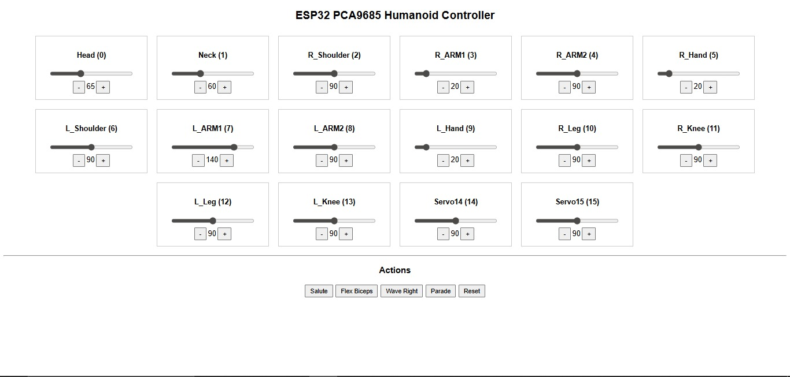
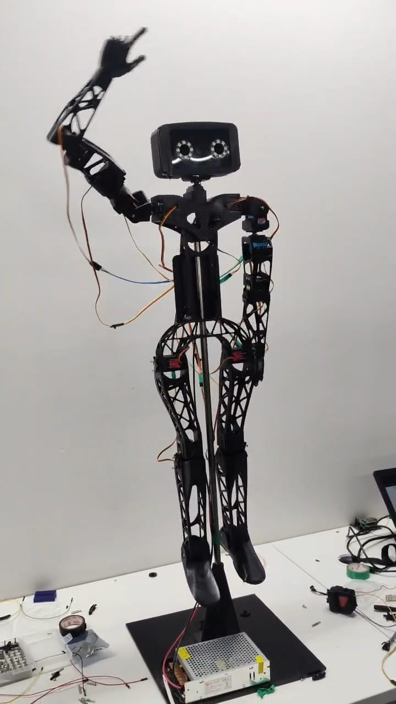

# ESP32-Based Humanoid Robot (Final Internship Project)

## Project Overview
This project is a **humanoid robot** developed as the **final project of my internship**.  
The robot was designed using **3D-printed parts** and controlled using an **ESP32 microcontroller**.  
It is operated **wirelessly over WiFi (OTA)** through a web-based control interface using the ESP32’s IP address.

The humanoid responds **immediately** to control commands such as salute and hand wave, demonstrating real-time wireless control.

---

## Key Highlights
- Final internship project
- Fully functional humanoid robot
- Wireless OTA control using WiFi
- Web-based control panel
- Immediate action response
- Built and tested successfully within **3 days**

---

## Mechanical Design
- All body parts were **3D printed**
- Modular structure for easy assembly and disassembly
- Robot was **dismembered after successful demonstration** as per internship requirement

---

## Hardware Components
- ESP32 Microcontroller
- PCA9685 Servo Driver Module
- 14 Servo Motors
- 3D Printed Robot Body Parts
- External Power Supply
- WiFi Network

---

## Servo Motor Configuration
A total of **14 servo motors** were used for realistic humanoid movement:

| Body Part | Servo Used |
|---------|-----------|
| Head | Yes |
| Neck | Yes |
| Right Shoulder | Yes |
| Right Arm (Upper & Lower) | Yes |
| Right Hand | Yes |
| Left Shoulder | Yes |
| Left Arm (Upper & Lower) | Yes |
| Left Hand | Yes |
| Right Leg | Yes |
| Right Knee | Yes |
| Left Leg | Yes |
| Left Knee | Yes |

---

## Software & Technologies Used
- ESP32 (Arduino Framework)
- WiFi (OTA Control)
- Web Server Interface
- PCA9685 Servo Control
- HTML/CSS/JavaScript (Web UI)
- 3D Printing Technology

---

## Control Method (OTA – Over The Air)
- ESP32 connects to WiFi using SSID & password
- A **web control panel** is accessed using the ESP32’s IP address
- Sliders allow manual control of each servo
- Predefined action buttons trigger motion sequences

---

## Supported Actions
The humanoid robot supports predefined actions including:
- Salute
- Wave Hand
- Flex Biceps
- Parade Movement
- Reset Position

Each command is executed **instantly** with smooth servo movement.

---

## Sample Control Interface

> The interface allows real-time control of all 14 servos and action buttons.

---

## Astor Overview

---

## Learning Outcomes
- Practical experience with humanoid robot design
- Servo motor synchronization
- ESP32 WiFi & OTA control
- Web-based hardware control
- PCA9685 multi-servo management
- 3D printing workflow and assembly
- Team-based project execution under time constraints

---

## Internship Status
✅ **Completed**  
This project was successfully demonstrated and evaluated as the **final internship project**.

---

## Note
This project was created for **internship learning, demonstration, and academic purposes**.  
The robot was disassembled after successful operation and testing.
