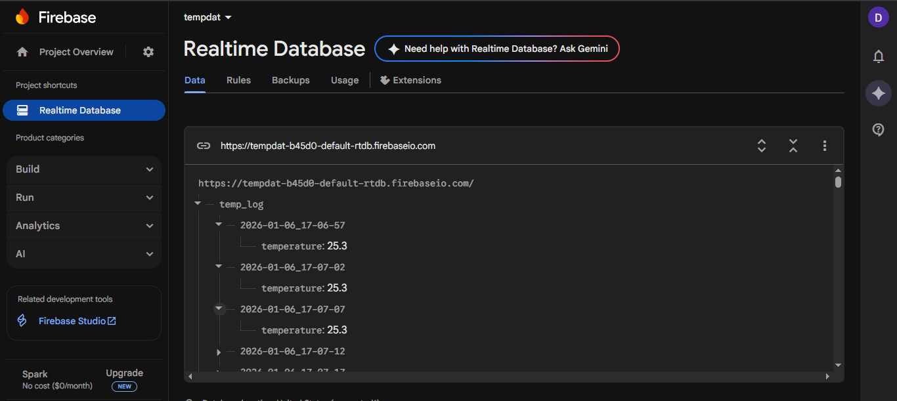

# 🌡️ ESP32 Firebase Temperature Logger

An **ESP32-based IoT project** that reads temperature data from a sensor and logs it to **Firebase** in real time.  
This project demonstrates **sensor data acquisition**, **Wi-Fi communication**, and **cloud-based data storage**.

---

## 📌 Project Overview

The ESP32 reads temperature values from a connected temperature sensor and sends the data wirelessly to **Firebase**.  
This enables **real-time monitoring** of temperature values from anywhere using the Firebase console or a connected dashboard.

---

## ✨ Features

- 🌡️ Real-time temperature monitoring
- ☁️ Firebase Realtime Database integration
- 📡 Wireless data transmission using Wi-Fi
- 🔄 Continuous sensor data logging
- 🧪 Simple and lightweight ESP32 firmware

---

## 🧰 Hardware Components Used

- ESP32 Development Board  
- Temperature Sensor (DHT / Analog temperature sensor)  
- Jumper wires  
- Breadboard  

---

## 💻 Software & Technologies

- Arduino IDE  
- ESP32 Arduino Core  
- Firebase Realtime Database  
- C / C++ (Arduino)  

---

## 📂 Project Structure

```

esp32-firebase-temperature-logger/
│
├── esp32-firebase-temperature-logger.ino
├── images/
│   └── Dashboard.png
└── README.md

```

---

## 📸 Project Output / Screenshot

Below is the output of the temperature logger displayed using Firebase:



> ℹ️ The image is stored inside the `images/` folder and referenced directly in this README.

---

## 🚀 How It Works

1. ESP32 connects to a Wi-Fi network  
2. Temperature sensor reads current temperature  
3. ESP32 sends the temperature value to Firebase  
4. Firebase stores and displays the data in real time  

---

## 🎓 Learning Outcomes

- Understanding ESP32 Wi-Fi connectivity
- Working with Firebase Realtime Database
- Sending sensor data to the cloud
- Structuring IoT projects for GitHub

---


## 📜 License

This project is intended for **educational purposes only**.

