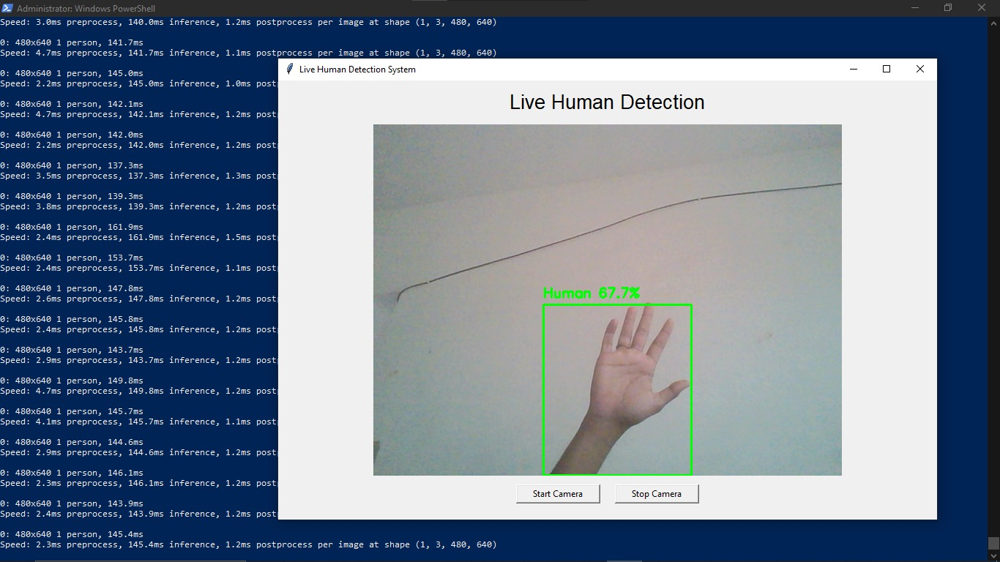

# Live Human Detection Using OpenCV

## Description
This project performs real-time human detection using a webcam. A trained YOLOv8 model is used along with OpenCV to detect humans in live video feed and display the results through a graphical interface.

## Features
- Real-time human detection using webcam
- Bounding boxes drawn around detected humans
- Live GUI-based visualization
- Fast and accurate detection using YOLOv8


## Sample Output



## Technologies Used
- Python
- OpenCV
- YOLOv8
- Webcam

## Project Structure
```

human-detection-opencv/
├── images/
│   └── image.jpeg
├── live_human_GUI.py
├── yolov8n.pt
└── README.md

```

## Working
- The webcam captures live video frames.
- Each frame is processed using the YOLOv8 model.
- Human objects are detected in real time.
- Detected humans are highlighted with bounding boxes on the screen.

## Files Description
- `live_human_GUI.py` – Python script for live human detection with GUI
- `yolov8n.pt` – Pre-trained YOLOv8 model file
- `images/image.jpeg` – Sample detection output image

## Learning Outcome
- Real-time object detection using deep learning
- OpenCV video processing
- Integrating YOLOv8 with Python
- GUI-based visualization for computer vision

## Applications
- Surveillance systems
- Smart security solutions
- Human activity monitoring
- Computer vision research

## Future Enhancements
- Human counting
- Activity recognition
- Alert system integration
- Model optimization for better performance


