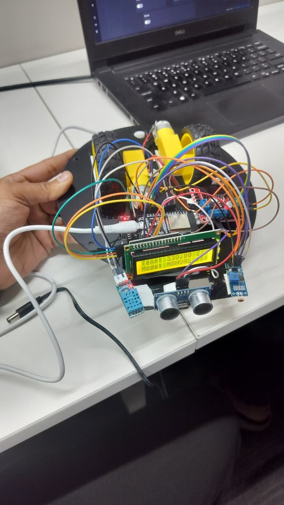
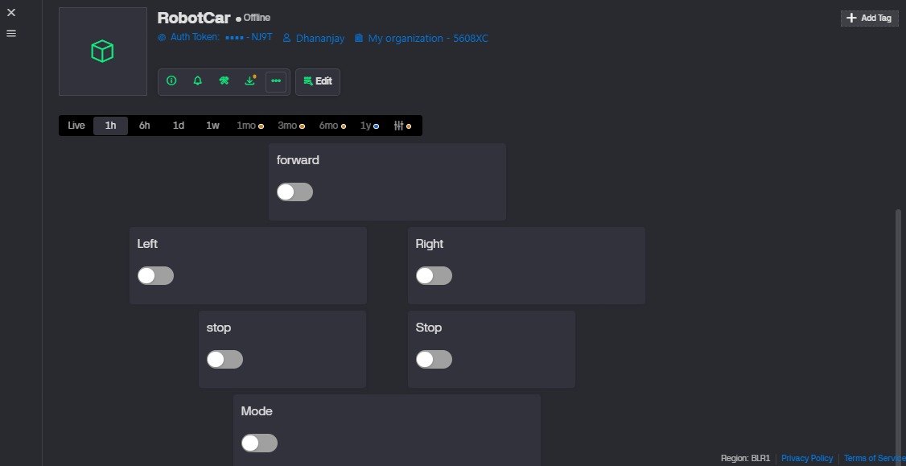

# WiFi Controlled Moving Robot Car

## Description
This project demonstrates a WiFi-controlled moving robot car using a microcontroller and the Blynk IoT platform. The robot can be controlled wirelessly from a mobile application to move in different directions.

## Features
- Wireless control using WiFi
- Forward, backward, left, and right movement
- Real-time control through Blynk IoT app
- Simple and responsive robot navigation

## Components Used
- Microcontroller (ESP32 / ESP8266 / Arduino with WiFi)
- Motor Driver Module
- DC Motors
- Robot Chassis
- Power Supply
- WiFi
- Blynk IoT Platform

## Working Principle
- The robot connects to a WiFi network.
- Control commands are sent from the Blynk IoT mobile app.
- The microcontroller receives commands via WiFi.
- Based on the command, the motor driver controls the motors to move the robot accordingly.

## Sample Output

### Robot Car

### Blynk IoT Control Interface

## Files Included
- `moving_robot.ino` – Main Arduino code
- `moving_robot.jpeg` – Robot image
- `moving-robot-vid.mp4` – Working demo video
- `RobotCar-BlynkIOT_Template.png` – Blynk IoT interface layout

## Learning Outcome
- Understanding WiFi-based robot control
- Working with Blynk IoT platform
- Motor driver and motor interfacing
- Real-time wireless communication

## Future Improvements
- Speed control using PWM
- Obstacle detection using sensors
- Camera-based live streaming
- Autonomous navigation modes
